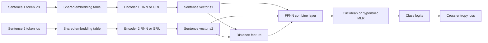
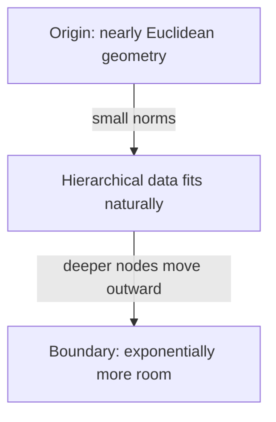
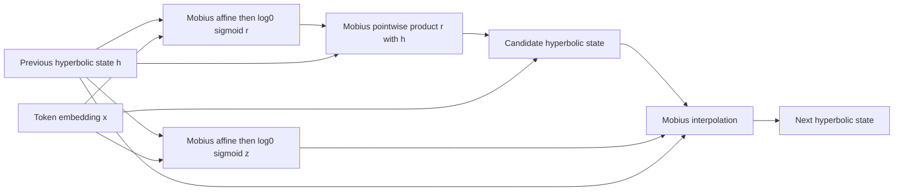
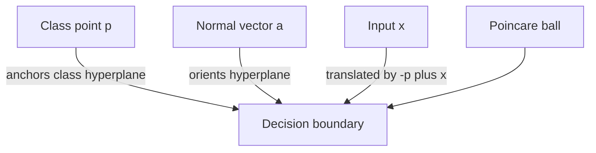

<!-- Created: 2026-06-23 15:50 UTC. Purpose: Explain the implemented hyperbolic neural network model, math, derivations, and visual intuition. This is permanent project documentation. -->

# Hyperbolic Model Math

This document explains the model implemented in `src/services/hyperbolic-nn/`. The main training path is `hyp_rnn.py`, the recurrent cells are in `rnn_impl.py`, and the Poincare ball operations are in `util.py`.

We follow Ganea et al. (2018) with curvature parameter `c > 0`, ball radius $1/\sqrt{c}$, and the same Poincare-ball convention. The code sometimes squares the paper's distances: when this document says "distance feature", it means squared Poincare distance $d_c(u,v)^2$ unless stated otherwise.

## 1. Model Overview

The main model is a sentence-pair classifier. Each example contains two padded token sequences and a label:

$$
(s_1, s_2, y)
$$

Each sentence is encoded by an RNN or GRU into a vector. Depending on the config, the hidden states live in either Euclidean space or the Poincare ball. The two sentence vectors are combined by a feed-forward layer and classified by multinomial logistic regression (MLR).

Core implementation references:

- `HyperbolicRNNModel.forward` in `src/services/hyperbolic-nn/hyp_rnn.py`, line 649.
- `HypRNN` and `HypGRU` in `src/services/hyperbolic-nn/rnn_impl.py`, lines 111 and 194.
- `mob_add`, `exp_map_zero`, `log_map_zero`, and `poinc_dist_sq` in `src/services/hyperbolic-nn/util.py`, lines 50, 175, 183, and 74.

## 1.1 Conventions And Paper Notation

- Dimension $n$ is the embedding and hidden-state width unless a section explicitly introduces another width.
- $\|\cdot\|$ is the Euclidean norm used inside the Poincare coordinate chart.
- The code uses $c > 0$ for absolute negative curvature, so the manifold curvature is $-c$.
- The paper's $D_c^n$ corresponds to this document's $\mathbb{D}_c^n$.
- The paper's $d_c(u,v)$ corresponds to `poinc_dist_sq(...) ** 0.5`; the code usually stores $d_c(u,v)^2$ as `distance_sq`.
- Superscript `$^c$` is sometimes omitted when the active curvature is clear.

Geometry conversion used throughout:

$$
x^{eucl} = \log_0^c(x^{hyp})
$$

$$
x^{hyp} = \exp_0^c(x^{eucl})
$$

This is how the paper stacks Euclidean operations on hyperbolic representations, and it is exactly what this code does when `sent_geom == "hyp"` but downstream layers use Euclidean geometry.

## 1.2 Why Hyperbolic Here

Hyperbolic space has exponential volume growth, so it can represent tree-like or hierarchical structure with less distortion than same-dimensional Euclidean space. That is the motivation behind the PREFIX experiments and the SNLI sentence-pair setup in Ganea et al. (2018), including the norm behavior discussed around Figures 3-5: useful hierarchy can be encoded radially, with more specific points moving outward in the ball. See Section 4 and Figures 3-5 in Ganea et al. for the PREFIX-Z%, SNLI, norm, and accuracy plots behind this behavior.

## 2. Poincare Ball Geometry

The hyperbolic space is represented by the Poincare ball:

$$
\mathbb{D}_c^n = \{x \in \mathbb{R}^n : c\|x\|^2 < 1\}
$$

where `c > 0` is the absolute curvature scale. The ball radius is:

$$
R = \frac{1}{\sqrt{c}}
$$

The code keeps vectors inside the ball with `project_hyp_vecs` in `src/services/hyperbolic-nn/util.py`, line 14:

$$
x \leftarrow x \cdot \min\left(1, \frac{(1-\epsilon)/\sqrt{c}}{\|x\|}\right)
$$

The Poincare metric is conformal to the Euclidean metric:

$$
g_x^c = \lambda_x^2 g^E
$$

with conformal factor:

$$
\lambda_x^c = \frac{2}{1-c\|x\|^2}
$$

This appears in `lambda_x` in `src/services/hyperbolic-nn/util.py`, line 116. As points approach the boundary, the denominator shrinks, so the geometry stretches distances.

## 3. Mobius Addition

Euclidean vector addition does not preserve hyperbolic geometry. The code uses Mobius addition:

$$
u \oplus_c v =
\frac{
(1 + 2c\langle u,v\rangle + c\|v\|^2)u
+ (1 - c\|u\|^2)v
}{
1 + 2c\langle u,v\rangle + c^2\|u\|^2\|v\|^2
}
$$

This is implemented by `mob_add` in `src/services/hyperbolic-nn/util.py`, line 50.

Why this formula: in the Poincare ball, translations are isometries, not straight Euclidean shifts. Mobius addition is the gyrovector-space analogue of translation. Near the origin, when norms are small:

$$
c\|u\|^2 \approx 0,\quad c\|v\|^2 \approx 0,\quad 2c\langle u,v\rangle \approx 0
$$

so:

$$
u \oplus_c v \approx u + v
$$

That is why hyperbolic layers behave like Euclidean layers near zero but differ strongly near the boundary.

Worked 2D example with $c=1$:

$$
u=(0.01,0),\quad v=(0,0.02)
$$

Because $\langle u,v\rangle=0$, $\|u\|^2=0.0001$, and $\|v\|^2=0.0004$:

$$
u \oplus_1 v
\approx
(0.010004,\ 0.019998)
\approx
u+v
$$

The small difference is why Mobius addition locally recovers Euclidean addition.

## 4. Distance

The model uses squared Poincare distance for sentence-pair features and regularization:

$$
d_c(u,v)^2 =
\left(
\frac{2}{\sqrt{c}}
\tanh^{-1}\left(\sqrt{c}\|-u \oplus_c v\|\right)
\right)^2
$$

This is implemented by `poinc_dist_sq` in `src/services/hyperbolic-nn/util.py`, line 74. The returned tensor is squared distance, not raw distance.

Derivation sketch:

1. Move `u` to the origin using the hyperbolic translation `-u \oplus_c v`.
2. Measure radial distance from the origin.
3. In the Poincare ball, radial distance from `0` to `z` is:

$$
d_c(0,z)=\frac{2}{\sqrt{c}}\tanh^{-1}(\sqrt{c}\|z\|)
$$

Substituting:

$$
z = -u \oplus_c v
$$

gives the implemented distance.

## 5. Exponential And Logarithmic Maps

The model frequently moves between the tangent space and the ball.

The tangent space at the origin behaves like ordinary Euclidean space. The exponential map sends a tangent vector into the ball:

$$
\exp_0^c(v)
=
\tanh(\sqrt{c}\|v\|)
\frac{v}{\sqrt{c}\|v\|}
$$

This is `exp_map_zero` in `src/services/hyperbolic-nn/util.py`, line 175.

The logarithmic map returns a ball point to the origin tangent space:

$$
\log_0^c(y)
=
\frac{1}{\sqrt{c}}
\tanh^{-1}(\sqrt{c}\|y\|)
\frac{y}{\|y\|}
$$

This is `log_map_zero` in `src/services/hyperbolic-nn/util.py`, line 183.

At a nonzero base point `x`, the exponential map is:

$$
\exp_x^c(v)
=
x \oplus_c
\left(
\tanh\left(
\frac{\sqrt{c}\lambda_x^c\|v\|}{2}
\right)
\frac{v}{\sqrt{c}\|v\|}
\right)
$$

This is `exp_map_x` in `src/services/hyperbolic-nn/util.py`, line 132, and is used by Riemannian SGD.

The matching logarithmic map is:

$$
\log_x^c(y)
=
\frac{2}{\sqrt{c}\lambda_x^c}
\tanh^{-1}\left(\sqrt{c}\|-x \oplus_c y\|\right)
\frac{-x \oplus_c y}{\|-x \oplus_c y\|}
$$

This is `log_map_x` in `src/services/hyperbolic-nn/util.py`, line 154.

## 6. Mobius Matrix Multiplication

Euclidean layers compute:

$$
Wx
$$

For hyperbolic vectors, the code uses Mobius matrix multiplication:

$$
M \otimes_c x
=
\frac{1}{\sqrt{c}}
\tanh\left(
\frac{\|Mx\|}{\|x\|}
\tanh^{-1}(\sqrt{c}\|x\|)
\right)
\frac{Mx}{\|Mx\|}
$$

This is `mob_mat_mul` in `src/services/hyperbolic-nn/util.py`, line 190.

Derivation intuition:

1. Map `x` to a tangent representation with radial coordinate:

$$
\tanh^{-1}(\sqrt{c}\|x\|)
$$

2. Apply the Euclidean matrix direction `Mx`.
3. Map back into the ball with `tanh`.

For diagonal gates, `mob_pointwise_prod` uses the same idea with:

$$
Mx = u \odot x
$$

## 7. Hyperbolic RNN Cell

The Euclidean RNN update is:

$$
h_t = \phi(h_{t-1}W + x_tU + b)
$$

The hyperbolic version replaces affine operations with Mobius operations:

$$
\tilde{h}_t =
(W \otimes_c h_{t-1})
\oplus_c
(U \otimes_c x_t)
\oplus_c
b
$$

Then the nonlinearity is applied through the tangent space:

$$
h_t =
\exp_0^c\left(
\phi(\log_0^c(\tilde{h}_t))
\right)
$$

This matches `HypRNN.forward` in `src/services/hyperbolic-nn/rnn_impl.py`, line 186, and `hyp_non_lin` in `src/services/hyperbolic-nn/util.py`, line 254.

If inputs or biases are configured as Euclidean, the code maps them into the ball first:

$$
x_t^{hyp}=\exp_0^c(x_t), \quad b^{hyp}=\exp_0^c(b)
$$

Concrete one-step path for Euclidean input:

$$
x_t
\xrightarrow{\exp_0^c}
x_t^{hyp}
\xrightarrow{U \otimes_c x_t^{hyp}}
U_x
$$

$$
h_{t-1}
\xrightarrow{W \otimes_c h_{t-1}}
W_h
$$

$$
\tilde{h}_t = W_h \oplus_c U_x \oplus_c b^{hyp}
$$

$$
h_t = \exp_0^c(\phi(\log_0^c(\tilde{h}_t)))
$$

In code, this is the sequence `exp_map_zero -> mob_mat_mul -> mob_add -> log_map_zero -> phi -> exp_map_zero`.

## 8. Hyperbolic GRU Cell

The Euclidean GRU is:

$$
z_t = \sigma(h_{t-1}W_z + x_tU_z + b_z)
$$

$$
r_t = \sigma(h_{t-1}W_r + x_tU_r + b_r)
$$

$$
\tilde{h}_t =
\tanh((r_t \odot h_{t-1})W_h + x_tU_h + b_h)
$$

$$
h_t = (1-z_t)\odot h_{t-1} + z_t\odot \tilde{h}_t
$$

The hyperbolic GRU keeps gates in the tangent space but hidden states in the ball. See `HypGRU.forward` in `src/services/hyperbolic-nn/rnn_impl.py`, line 262.

The update gate is:

$$
z_t =
\sigma\left(
\log_0^c(
(W_z \otimes_c h_{t-1})
\oplus_c
(U_z \otimes_c x_t)
\oplus_c
b_z
)
\right)
$$

The reset gate is:

$$
r_t =
\sigma\left(
\log_0^c(
(W_r \otimes_c h_{t-1})
\oplus_c
(U_r \otimes_c x_t)
\oplus_c
b_r
)
\right)
$$

The reset operation is a Mobius diagonal product:

$$
r_t \odot_c h_{t-1}
$$

The candidate hidden state is:

$$
\tilde{h}_t =
\exp_0^c
\left(
\phi\left(
\log_0^c(
(W_h \otimes_c (r_t \odot_c h_{t-1}))
\oplus_c
(U_h \otimes_c x_t)
\oplus_c
b_h
)
\right)
\right)
$$

The final update is a hyperbolic interpolation from `h` toward `h_tilde`:

$$
h_t =
h_{t-1}
\oplus_c
\left(
z_t \odot_c
(-h_{t-1} \oplus_c \tilde{h}_t)
\right)
$$

This matches `HypGRU.forward`.

## 9. Sentence Encoding

For each token index, `encode_sentence` in `src/services/hyperbolic-nn/hyp_rnn.py`, line 615, updates only active batch items:

$$
m_{i,t} = \mathbb{1}[\ell_i > t]
$$

$$
h_{i,t} =
m_{i,t}\hat{h}_{i,t}
+ (1-m_{i,t})h_{i,t-1}
$$

This prevents padded tokens from changing finished sentence states.

The final sentence vectors are:

$$
s_1 = \operatorname{Encoder}_1(x_1,\ldots,x_m)
$$

$$
s_2 = \operatorname{Encoder}_2(x_1,\ldots,x_n)
$$

If sentence geometry is hyperbolic, `s_1` and `s_2` are points in `\mathbb{D}_c^d`.

## 10. Sentence-Pair FFNN Layer

The model computes a distance feature in `HyperbolicRNNModel.forward` in `src/services/hyperbolic-nn/hyp_rnn.py`, lines 660-663. This feature is squared distance:

$$
\delta =
\begin{cases}
\|s_1-s_2\|^2, & \text{Euclidean sentence geometry} \\
d_c(s_1,s_2)^2, & \text{Hyperbolic sentence geometry}
\end{cases}
$$

For Euclidean FFNN geometry:

$$
o =
s_1W_1 + s_2W_2 + b
$$

If `additional_features == "dsq"`:

$$
o =
s_1W_1 + s_2W_2 + b + \delta b_d
$$

For hyperbolic FFNN geometry:

$$
o =
(W_1 \otimes_c s_1)
\oplus_c
(W_2 \otimes_c s_2)
\oplus_c
b
$$

With the distance feature:

$$
o =
o \oplus_c (\delta \otimes_c b_d)
$$

Then the configured nonlinearity is applied in Euclidean space or through:

$$
\exp_0^c(\phi(\log_0^c(o)))
$$

Concrete geometry-mixing rule:

$$
\text{hyperbolic encoder to Euclidean FFNN:}\quad s^{eucl}=\log_0^c(s)
$$

$$
\text{Euclidean dropout output to hyperbolic MLR:}\quad o^{hyp}=\exp_0^c(o)
$$

This is the same hyperbolic-to-Euclidean handoff used in the paper when a Euclidean classifier is stacked on hyperbolic encoders. The code path is in `src/services/hyperbolic-nn/hyp_rnn.py`, lines 664-706.

## 11. Euclidean MLR

For Euclidean MLR, each class has a normal vector `a_k` and point `p_k`. The logit is:

$$
\ell_k(x) =
\langle x - p_k, a_k\rangle
$$

This is a signed distance-like score to a Euclidean hyperplane.

## 12. Hyperbolic MLR

Hyperbolic MLR uses a point `p_k` in the ball and a tangent normal vector `a_k`. The implementation is in `src/services/hyperbolic-nn/hyp_rnn.py`, lines 715-726, and the same formula appears in `src/services/hyperbolic-nn/mnist_sanity.py`, lines 65-80.

The code first translates the input by `-p_k`:

$$
v_k = -p_k \oplus_c x
$$

Then it computes:

$$
\ell_k(x)
=
\frac{2}{\sqrt{c}}
\|a_k\|
\sinh^{-1}
\left(
\sqrt{c}
\lambda_{v_k}^c
\left\langle v_k, \frac{a_k}{\|a_k\|}\right\rangle
\right)
$$

This is Eq. (25) from Ganea et al. (2018) written with the code's translated point $v_k=-p_k\oplus_c x$ and code convention $c>0$.

Algebra link to the paper:

$$
\lambda_{v_k}^c = \frac{2}{1-c\|v_k\|^2}
$$

so the denominator term in the paper can be rewritten as:

$$
\frac{2}{1-c\|v_k\|^2}
=
\lambda_{v_k}^c
$$

Equivalently, the paper's explicit $(1-c\|v_k\|^2)\|a_k\|$ denominator inside `asinh` is represented here by $\lambda_{v_k}^c$ up to a constant scaling factor that can be absorbed into the learned vector $a_k$.

The paper's sign and absolute-value convention can be absorbed by learning $a_k$:

$$
\langle v_k,\hat{a}_k\rangle
\quad \text{with} \quad
\hat{a}_k=\frac{a_k}{\|a_k\|}
$$

because replacing $a_k$ by $-a_k$ flips the signed side of the class hyperplane without changing the represented family of decision surfaces.

Intuition:

- `p_k` chooses where the class boundary is anchored.
- `a_k` chooses the normal direction.
- The conformal factor `lambda` accounts for local stretching in the Poincare ball.
- The `asinh` term converts the signed hyperbolic distance-like quantity into a logit.

The visualization script `viz_mlr.py` samples points satisfying an approximate orthogonality constraint:

$$
\langle -p \oplus_c x, a\rangle \approx 0
$$

Those points form the hyperbolic decision surface.

## 13. Loss Function

The base objective is cross entropy:

$$
\mathcal{L}_{CE}
=
-\frac{1}{N}
\sum_{i=1}^{N}
\log
\frac{\exp(\ell_{i,y_i})}
{\sum_k \exp(\ell_{i,k})}
$$

If `reg_beta > 0`, the model adds a two-class distance regularizer using squared distance. See `compute_loss` in `src/services/hyperbolic-nn/hyp_rnn.py`, lines 731-746:

$$
\mathcal{L}
=
\mathcal{L}_{CE}
+ \beta
\frac{1}{N}
\sum_i
(y_i - 0.5)d(s_{1,i},s_{2,i})^2
$$

This encourages the sentence distance to encode class structure. For binary labels, examples with different labels can push distances in opposite directions depending on label encoding.

## 14. Optimization

The implementation separates parameters into Euclidean and hyperbolic groups:

- Euclidean parameters use Adam.
- Hyperbolic parameters use manual RSGD or projected SGD.
- `hyp_opt == "rsgd"` uses the exponential-map update.
- `hyp_opt == "projsgd"` uses the ambient projected update.
- The code follows the paper's split learning rates for word embeddings vs other hyperbolic parameters: `lr_words` updates hyperbolic embeddings, and `lr_ffnn` updates other hyperbolic parameters.
- The main divergence is Euclidean parameters: this PyTorch port uses Adam for Euclidean groups, while the hyperbolic groups keep the explicit RSGD/projSGD logic.
- The hyperbolic update logic is otherwise a direct port of the TensorFlow authors' repo.

For Poincare-ball RSGD, the Euclidean gradient is converted to a Riemannian gradient using the inverse metric factor:

$$
\nabla_R \mathcal{L}(x)
=
\frac{1}{(\lambda_x^c)^2}
\nabla_E \mathcal{L}(x)
$$

Since:

$$
\lambda_x^c = \frac{2}{1-c\|x\|^2}
$$

then:

$$
\frac{1}{(\lambda_x^c)^2}
=
\frac{(1-c\|x\|^2)^2}{4}
$$

This is implemented by `riemannian_gradient_c` in `src/services/hyperbolic-nn/util.py`, line 236. The trainer logic is in `RiemannianTrainer` in `src/services/hyperbolic-nn/hyp_rnn.py`, lines 749-854.

The RSGD update is:

$$
x_{t+1}
=
\exp_{x_t}^c
\left(
-\eta \nabla_R \mathcal{L}(x_t)
\right)
$$

Projected SGD instead takes an ambient step and projects back into the ball:

$$
x_{t+1}
=
\operatorname{proj}
\left(
x_t - \eta \nabla_R \mathcal{L}(x_t)
\right)
$$

The code also clips gradients before the hyperbolic update.

## 15. Why Hyperbolic Geometry Helps

As noted near the model overview, the purpose is representational efficiency for hierarchy-like structure. Hyperbolic space grows volume exponentially with radius:

For an approximate radial coordinate `r`, available volume grows like:

$$
\operatorname{Vol}(B(r)) \propto \sinh^{n-1}(\sqrt{c}r)
$$

For large `r`:

$$
\sinh(r) \approx \frac{e^r}{2}
$$

so there is exponentially more representational room near the boundary. This ties back to the PREFIX hierarchy experiments, SNLI sentence-pair classification, and the norm plots in Ganea et al. (2018), Figures 3-5.

## 16. Reference Concepts

- Poincare ball model: conformal model of hyperbolic space inside an open Euclidean ball.
- Riemannian metric: smoothly varying inner product over tangent spaces.
- Conformal factor: local scale factor relating Euclidean and hyperbolic lengths.
- Geodesic: shortest path under the Riemannian metric.
- Exponential map: maps a tangent vector to the manifold along a geodesic.
- Logarithmic map: inverse of the exponential map locally.
- Gyrovector space: algebraic framework where Mobius addition plays the role of vector addition.
- Riemannian SGD: gradient descent that respects manifold geometry.

## 17. Papers And References

- Ganea, Becigneul, and Hofmann, "Hyperbolic Neural Networks", NeurIPS 2018.
- Nickel and Kiela, "Poincare Embeddings for Learning Hierarchical Representations", NeurIPS 2017.
- Bonnabel, "Stochastic Gradient Descent on Riemannian Manifolds", IEEE Transactions on Automatic Control, 2013.
- Ungar, "Analytic Hyperbolic Geometry and Albert Einstein's Special Theory of Relativity", 2008.

